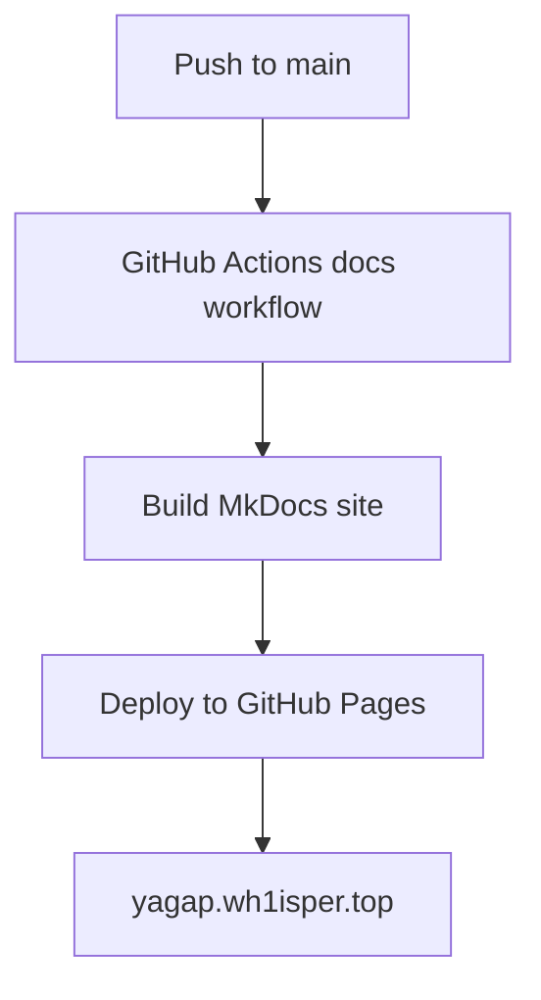
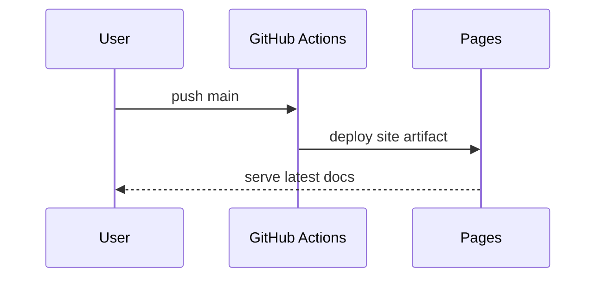

# Mermaid Demo

```mermaid
flowchart TD
    A[Push to main] --> B[GitHub Actions docs workflow]
    B --> C[Build MkDocs site]
    C --> D[Deploy to GitHub Pages]
    D --> E[yagap.wh1isper.top]
```

```mermaid
sequenceDiagram
    participant U as User
    participant G as GitHub Actions
    participant P as Pages
    U->>G: push main
    G->>P: deploy site artifact
    P-->>U: serve latest docs
```
