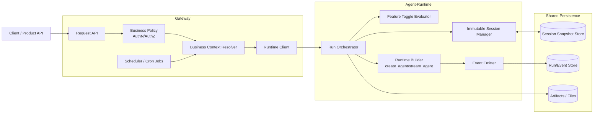
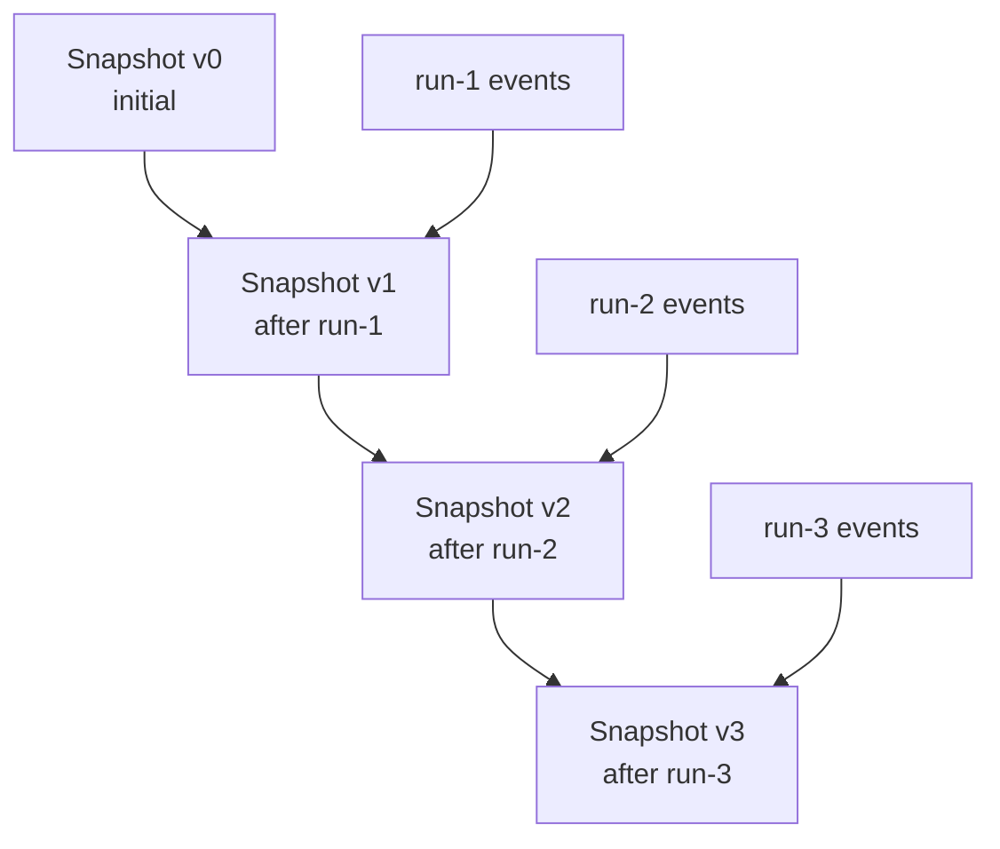
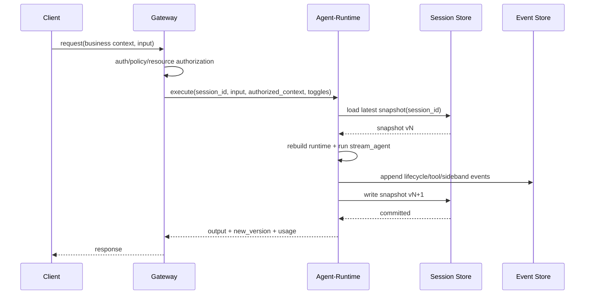

# Architecture Overview

## Scope

This document defines the high-level architecture for a stateless agent platform in `yagap`, with two runtime commands:

- `gateway`: business domain entrypoint (API, policy, scheduling/cron, and routing)
- `agent-runtime`: execution engine for agentic flows with immutable `session_id` management

The design is grounded on `ya-agent-sdk` primitives:

- `AgentContext` + `ResumableState`
- `stream_agent` lifecycle/event model
- Toolset and subagent orchestration
- Message bus and sideband events
- Resumable resources abstraction

## Design Goals

- Stateless compute nodes for both `gateway` and `agent-runtime`
- Immutable session snapshots managed only by `agent-runtime`
- Clear separation between business logic and execution logic
- Deterministic replayability for audit and debugging
- Horizontal scalability and tenant-level isolation

## Non-Goals

- UI and external API contract details
- Provider-specific model tuning
- Storage engine internals

## Responsibility Boundaries

### gateway

- Owns business identity model (`tenant_id`, `user_id`, `project_id`, and optional business keys)
- Performs authentication, authorization, and policy checks
- Resolves business context to platform execution requests
- Selects and authorizes resource grants for downstream execution
- Hosts business-side orchestration such as scheduler/cron jobs

### agent-runtime

- Owns immutable platform `session_id`
- Executes agentic runs and persists snapshot versions
- Applies runtime feature/capability toggles
- Does not own business identity semantics
- Consumes only authorized execution context from `gateway`

## Logical Components

## Session Model

`agent-runtime` manages only immutable platform sessions:

- `session_id` is platform-scoped and immutable
- snapshots are append-only versions (`v0 -> v1 -> v2 ...`)
- every run reads one base version and writes one next version

Business identity (`tenant/user/project`) is maintained in `gateway` and never becomes the ownership model of runtime sessions.

## Runtime Mapping to ya-agent-sdk

Inside each run, `agent-runtime` maps snapshots to SDK runtime:

- Snapshot -> `ResumableState`
- Rebuild `AgentContext` from environment and authorized runtime inputs
- Execute with `stream_agent`
- Export next state via `ctx.export_state()`
- Persist as next immutable snapshot version

## End-to-End Flow

## Concurrency and Consistency

For a single `session_id`, snapshot commit uses optimistic concurrency:

- read base version `vN`
- write `vN+1` with precondition `base_version == vN`
- on conflict, reject or retry based on gateway policy

## Isolation Model

- `gateway` enforces all business-level authorization and resource grants
- `agent-runtime` validates request integrity and session version consistency
- runtime persistence is partitioned for tenant-safe operations, but without embedding business identity as runtime ownership semantics

## Event and Audit Model

Persisted event stream includes:

- run lifecycle (start/complete/fail)
- model request and tool-call phases
- sideband events (handoff, compact, subagent, bus)
- usage and cost metadata

Events are correlated by `run_id` and linked to snapshot transitions.

## Failure Handling

- if run fails before snapshot commit, no new snapshot is published
- partial execution is visible through events only
- optional recovery mode may persist crash diagnostics and usage records

## Open Discussion Topics

- boundary contract between `gateway` and `agent-runtime`
- conflict retry matrix (interactive vs scheduled runs)
- snapshot granularity (per-run vs selective checkpointing)
- event retention and compaction policies
- multi-region routing and failover strategy
