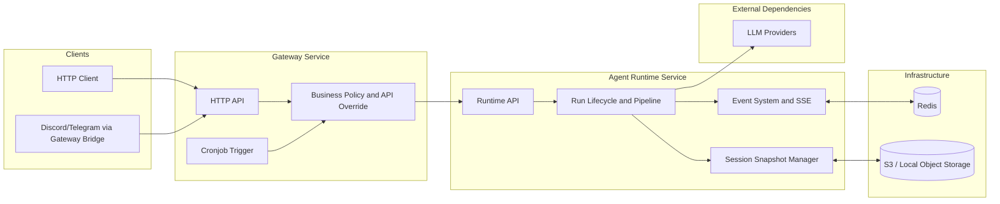
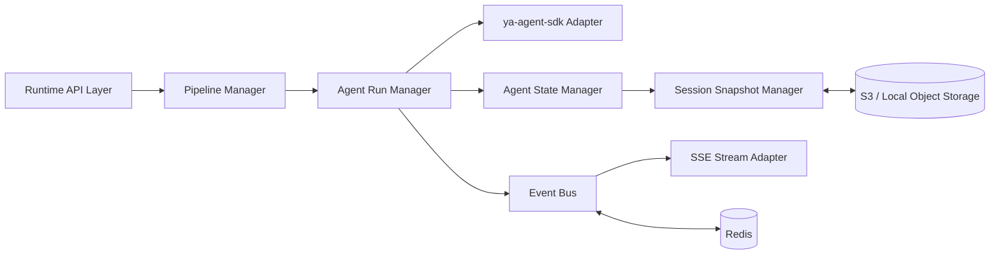
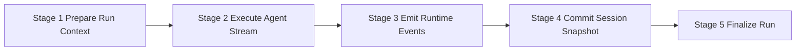

# Agent Runtime Architecture

## Scope

This document defines the high-level architecture of `agent-runtime` in YAGAP.

`agent-runtime` focuses on three core capabilities:

- Runtime management for in-flight agent runs
- Custom runtime event system and SSE streaming
- Immutable session snapshot persistence

The runtime is built on `ya-agent-sdk` (a fork of `pai-agent-sdk`).

## Design Principles

- Keep runtime minimal and execution-focused
- Keep pipeline explicit but lightweight for future extension
- Keep session state immutable with versioned snapshots
- Keep infrastructure simple: Redis + S3/Local object storage
- Keep boundary clean: gateway owns business policy, runtime owns execution lifecycle

## Relationship with Other Services

## Runtime Component Model

## Internal Responsibilities

| Component                | Responsibility                                                            |
| ------------------------ | ------------------------------------------------------------------------- |
| Runtime API Layer        | Accept run/stream/control requests from gateway                           |
| Pipeline Manager         | Execute minimal pipeline stages in fixed order                            |
| Agent Run Manager        | Manage run lifecycle (`created -> running -> completed/failed/cancelled`) |
| Agent State Manager      | Map runtime state to/from SDK resumable state                             |
| Session Snapshot Manager | Load base snapshot and persist next immutable snapshot                    |
| Event Bus                | Normalize runtime events and distribute to consumers                      |
| SSE Stream Adapter       | Convert internal events into SSE stream contract                          |
| ya-agent-sdk Adapter     | Encapsulate integration with `create_agent` / `stream_agent`              |

## Minimal Pipeline Shape

## Runtime-Gateway Boundary

Gateway responsibilities:

- Authentication and authorization
- Business identity and policy enforcement
- API-level override decisions

Runtime responsibilities:

- Execute run with resolved inputs
- Manage run lifecycle and in-flight control
- Manage event production and SSE output
- Persist immutable session snapshots

## Storage Assumptions

- Redis stores transient runtime data and event-distribution buffers
- S3/Local object storage stores immutable session snapshots
- No database dependency in current phase

## Out of Scope

- A/B testing and experiment routing
- Git/business workspace operations
- Complex multi-pipeline orchestration
- Multi-region routing and failover design
