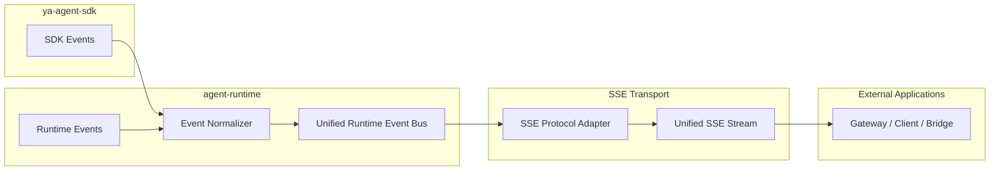
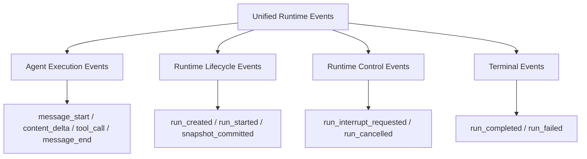
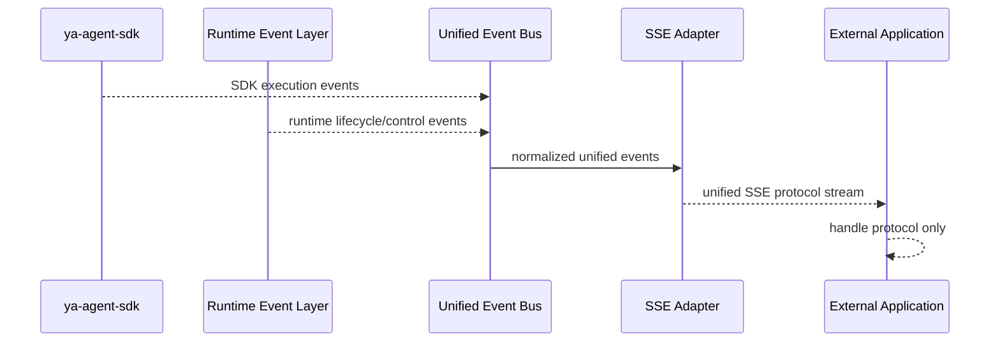

# Agent Runtime Event System and SSE

## Scope

This document defines the high-level event architecture of `agent-runtime`.

The design uses two event layers:

- SDK Event Layer: native events produced by `ya-agent-sdk`
- Runtime Event Layer: runtime-specific events added by `agent-runtime`

SSE exposes a unified transport protocol so external applications only consume one stable event contract.

## Design Principles

- Reuse SDK-native event semantics as the execution foundation
- Add runtime events only for lifecycle, control, and platform observability
- Keep external protocol stable even if internal event models evolve
- Keep transport concerns separate from execution concerns

## Two-Layer Event Architecture

## Event Layer Responsibilities

| Layer                     | Responsibility                                                |
| ------------------------- | ------------------------------------------------------------- |
| SDK Event Layer           | Provide agent execution events from `ya-agent-sdk`            |
| Runtime Event Layer       | Add runtime lifecycle and control-domain events               |
| Unified Runtime Event Bus | Merge, normalize, and order events into one runtime stream    |
| SSE Protocol Adapter      | Convert unified runtime events into transport protocol frames |

## Event Categories

## Event Flow (Conceptual)

## Unified SSE Protocol Contract

The SSE stream is defined as a transport contract over unified runtime events.

Contract goals:

- Single protocol for all upstream clients and bridges
- Consistent event envelope across SDK-origin and runtime-origin events
- Predictable terminal semantics for completion and failure

External applications are protocol consumers. They do not need to understand internal SDK/runtime event source differences.

## Ordering and Consistency Model

- Events are emitted as a single ordered stream per run
- Terminal events are final for that run stream
- Snapshot commit visibility is represented as explicit runtime events

## Boundary and Evolution

- Internal event taxonomy can evolve by layer
- SSE contract remains stable as the external compatibility surface
- New internal events are introduced through normalization before transport exposure

## Out of Scope

- Protocol field-level schema details
- Reconnect/replay mechanics
- Storage-level event retention policy
