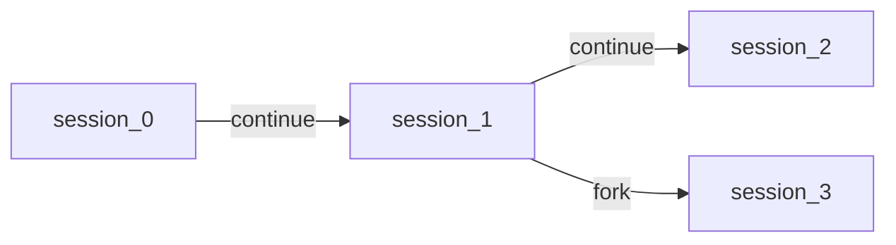
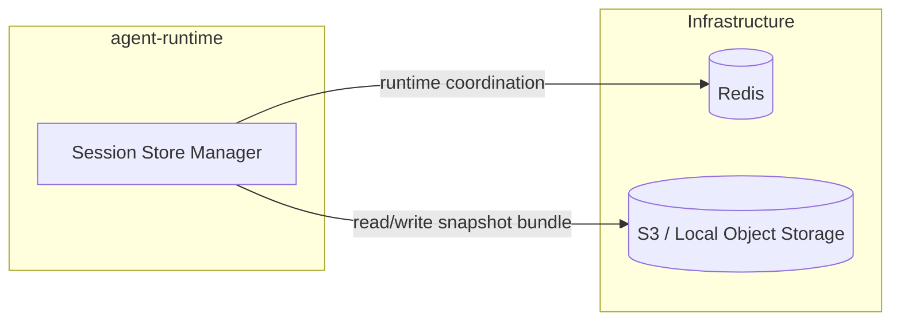
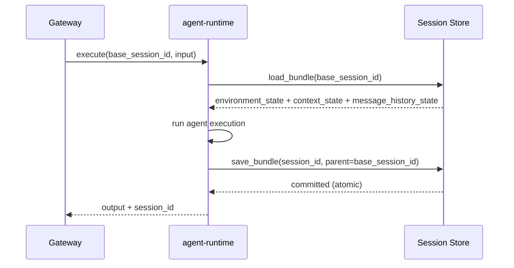

# Agent Runtime Session Store

## Scope

This document defines the high-level session storage design of `agent-runtime`.

The session model is immutable and versionless:

- A session snapshot is identified by `session_id`
- Every run writes a new `session_id`
- Session continuity is represented by parent linkage between immutable snapshots

## Design Principles

- Immutable snapshots only; no in-place mutation
- Versionless identity model (`session_id` as snapshot identity)
- Keep the design minimal and practical
- Infrastructure baseline: Redis + S3/Local object storage
- Session commit must be atomic at bundle level

## Session Identity Model

Each snapshot stores minimal lineage metadata (parent session reference) for continuation and forking.

## Session Data Bundle

Session data is persisted as one logical bundle:

- `environment_state`
- `context_state`
- `message_history_state` (main agent)
- `parent_session_id`

These parts are owned by different runtime concerns, but they are committed as one immutable snapshot unit.

## Storage Topology

## Atomic Read and Commit Flow

## Concurrency Model

Coordination is session-id based:

- A continuation request always targets one immutable base `session_id`
- Runtime allows one active run per continuation path
- Concurrent continuation requests on the same base are rejected

## Failure Semantics

- If run fails before commit, no new `session_id` is produced
- Existing snapshots are never modified
- No partial bundle write is visible to readers
