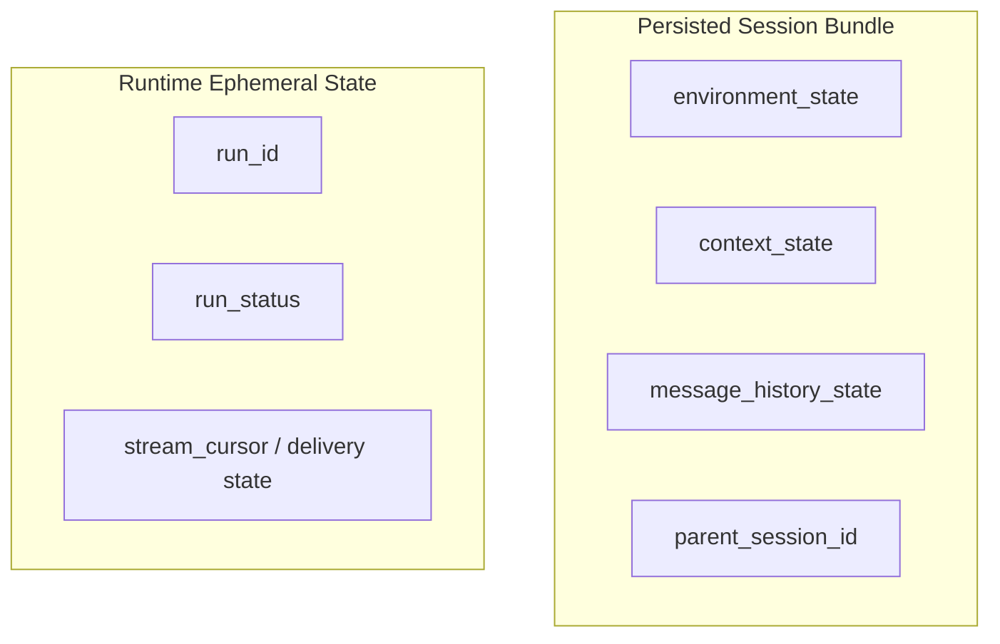
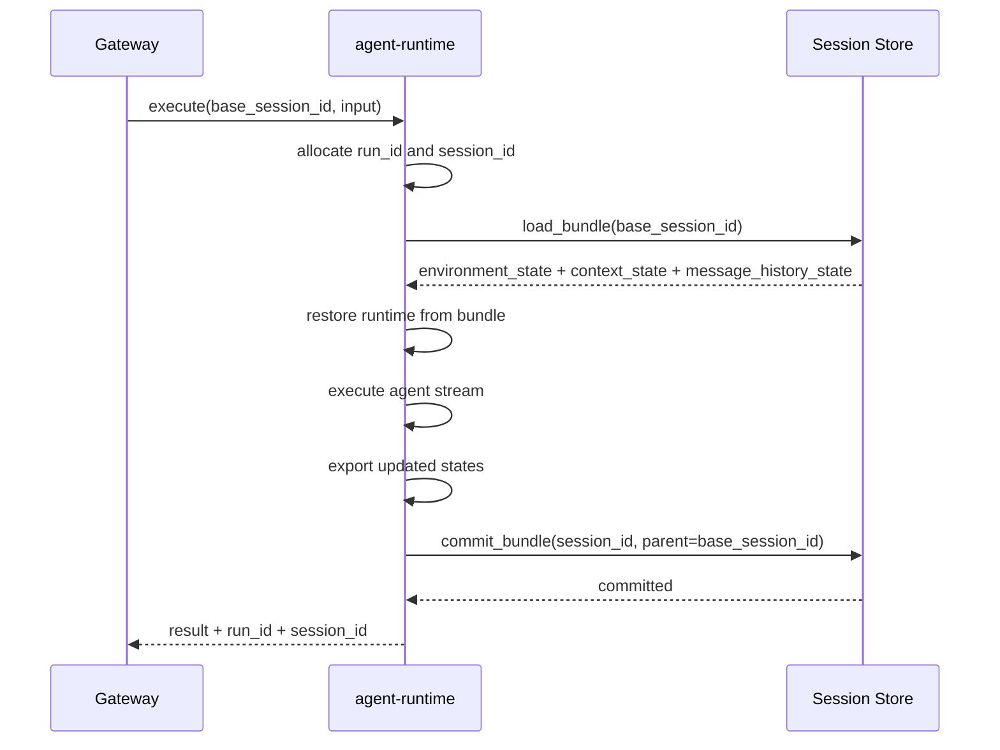
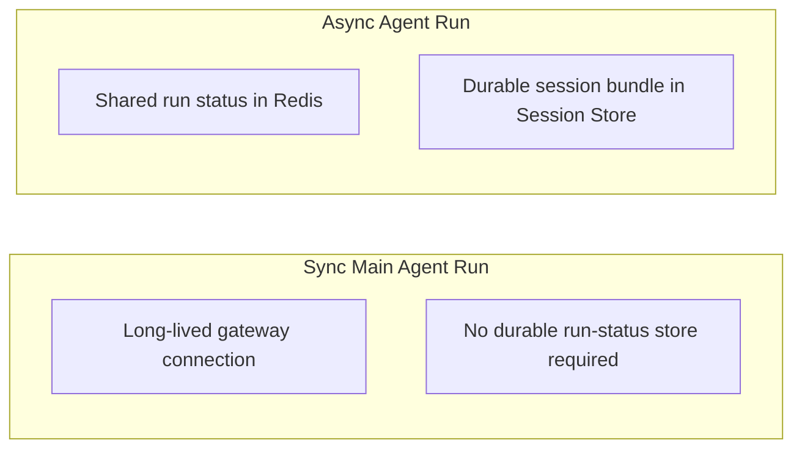

# Agent Runtime Agent State Management

## Scope

This document defines how `agent-runtime` manages agent state across one run lifecycle.

State management focuses on three persisted session parts:

- `environment_state`
- `context_state`
- `message_history_state` (main agent)

These three parts are restored together and committed together as one session bundle.

## Design Principles

- Keep persisted state minimal and execution-oriented
- Keep state boundaries explicit by concern
- Keep commit atomic across all persisted session parts
- Keep run control data separate from persisted session data

## State Boundary Model

Persisted session bundle is durable and immutable.
Runtime ephemeral state is execution-time control data.

## Run Lifecycle State Flow

## Runtime Identity in State Management

- `run_id` identifies one execution instance for control operations
- `session_id` is allocated at run start and used as commit target
- `base_session_id` is the immutable input snapshot reference

This allows downstream references to be stable during execution while preserving immutable session semantics.

## Sync and Async State Handling

Both sync and async runs use the same persisted session bundle model.
Only async runs require shared runtime status for later consumption/control.

## Failure Semantics

- If execution fails before commit, no new session bundle is published
- Persisted bundle is all-or-nothing
- Runtime control state can end in failed/cancelled without mutating existing sessions
