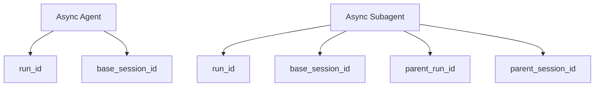
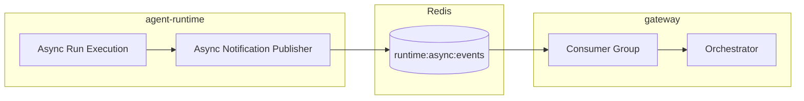
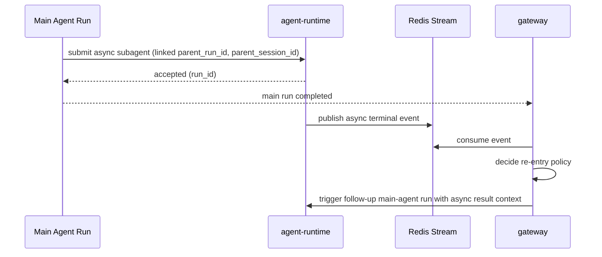

# Agent Runtime Async Agent

## Scope

This document defines the high-level async execution model in `agent-runtime`.

Two async types are supported:

- Async Agent: standalone background run
- Async Subagent: background run linked to a parent main-agent run/session

## Design Principles

- Reuse the same run model (`run_id`) for sync and async
- Keep async notification event-driven via Redis Stream
- Keep orchestration decisions in gateway
- Keep runtime focused on execution and status publication

## Async Identity Model

`run_id` is generated for every run.
Main-agent run allocates `run_id` and `session_id` at start so later async linkage can reference stable identifiers.

## Async Notification Channel

Redis Stream is used instead of Pub/Sub because async completion is optional to consume immediately and may require delayed consumption.

## Notification Semantics

- Runtime publishes lifecycle and terminal async events to stream
- Gateway consumes with consumer group
- Gateway decides business action on completion (notify user, trigger follow-up run, ignore)

## Delivery and Idempotency

Consumer group provides delivery coordination, but business handling remains at-least-once.
Gateway should process async terminal events idempotently using event identity.

## Async Subagent Re-entry Flow

## Open Point

Webhook callback can be added later as an optional outbound integration.
Current baseline is Redis Stream + gateway consumer group orchestration.
