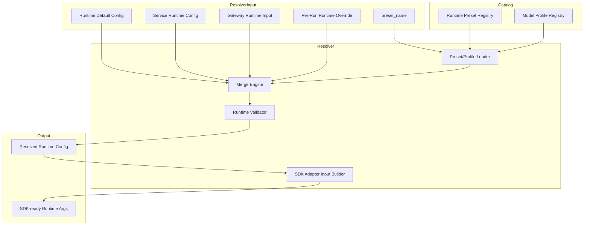
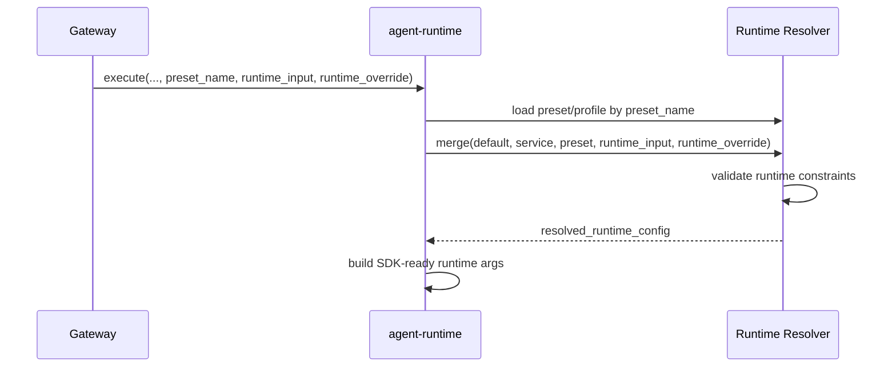

# Agent Runtime Config and Resolver

## Scope

This document defines runtime-side configuration modules and resolver behavior.

Runtime configuration stays execution-focused, while supporting runtime preset selection for model/tool behavior.

## Design Principles

- Runtime accepts gateway-provided runtime intent and override
- Runtime supports runtime preset and model profile selection
- Runtime merge order is deterministic and auditable
- Runtime config remains decoupled from business policy semantics

## Boundary

Runtime resolver input:

- runtime default config
- service runtime config
- runtime preset reference (`preset_name`)
- gateway runtime input
- per-run runtime override

Runtime resolver output:

- resolved runtime config used by pipeline and SDK adapter

Not in runtime resolver scope:

- business preset lifecycle and governance
- A/B or experiment decision
- tenant/business authorization semantics

## Runtime Config Model



## Resolver Priority Order

```text
Per-Run Runtime Override
> Gateway Runtime Input
> Runtime Preset
> Service Runtime Config
> Runtime Default Config
```

## Runtime Preset and Model Profile

- Runtime Preset is a named execution bundle
- Runtime Preset references a Model Profile
- Model Profile defines model-level executable settings
- Gateway can choose `preset_name` and still apply per-run override

This keeps model selection simple and stable, while preserving runtime-side validation.

## Runtime Config Domains

- model and tool execution knobs
- stream and event behavior toggles
- session behavior toggles
- async run behavior toggles
- runtime feature flags

## Resolver Flow



## Validation Goals

- ensure `preset_name` and model profile are valid
- ensure toggle combinations are compatible
- ensure runtime limits are inside service safety bounds

## Out of Scope

- gateway-side config storage schema
- business preset governance process
- experiment platform integration
