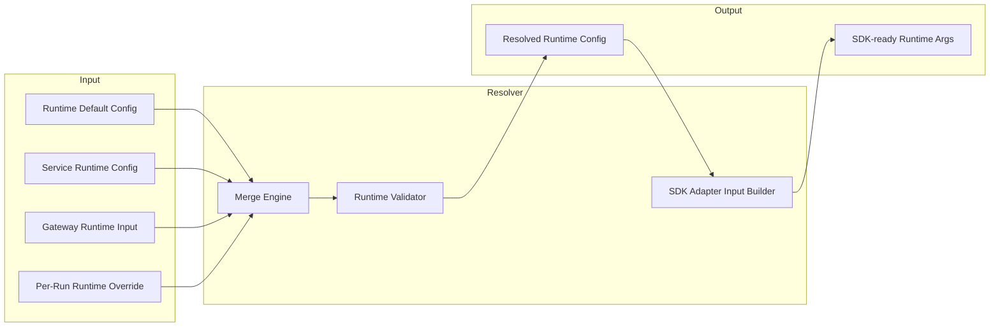
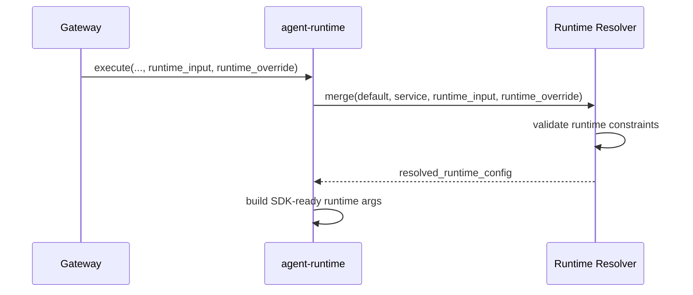

# Agent Runtime Config and Resolver

## Scope

This document defines runtime-side configuration modules and resolver behavior.

Runtime configuration is execution-focused. It does not resolve business presets or experiment strategies.

## Design Principles

- Runtime accepts gateway-provided runtime intent and override only
- Runtime validates executable safety and compatibility
- Runtime merge order is deterministic and auditable
- Runtime config remains decoupled from business policy semantics

## Boundary

Runtime resolver input:

- service runtime config
- gateway runtime input
- per-run runtime override

Runtime resolver output:

- resolved runtime config used by pipeline and SDK adapter

Not in runtime resolver scope:

- preset lookup
- A/B or experiment decision
- business policy conflict resolution

## Resolver Architecture



## Priority Order

```text
Per-Run Runtime Override > Gateway Runtime Input > Service Runtime Config > Runtime Default Config
```

## Runtime Config Domains

- model and tool execution knobs
- stream and event behavior toggles
- session behavior toggles
- async run behavior toggles
- runtime feature flags

## Resolver Flow



## Validation Goals

- ensure required runtime fields are present
- ensure toggle combinations are compatible
- ensure runtime limits are inside service safety bounds

## Out of Scope

- gateway-side config storage schema
- preset and experiment lifecycle
- tenant/business authorization semantics
