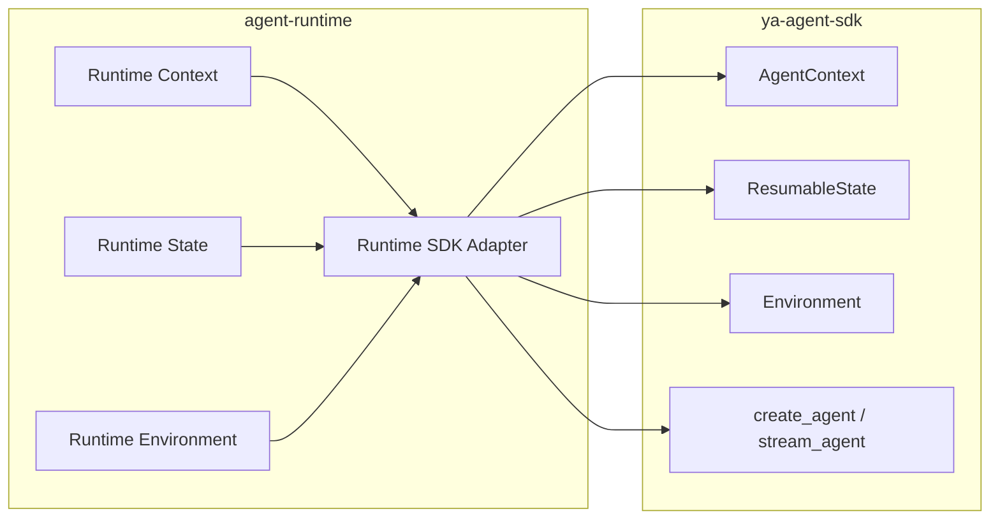
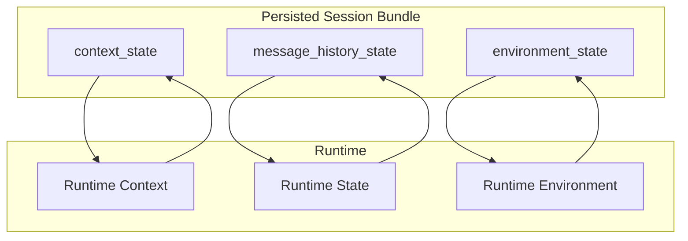
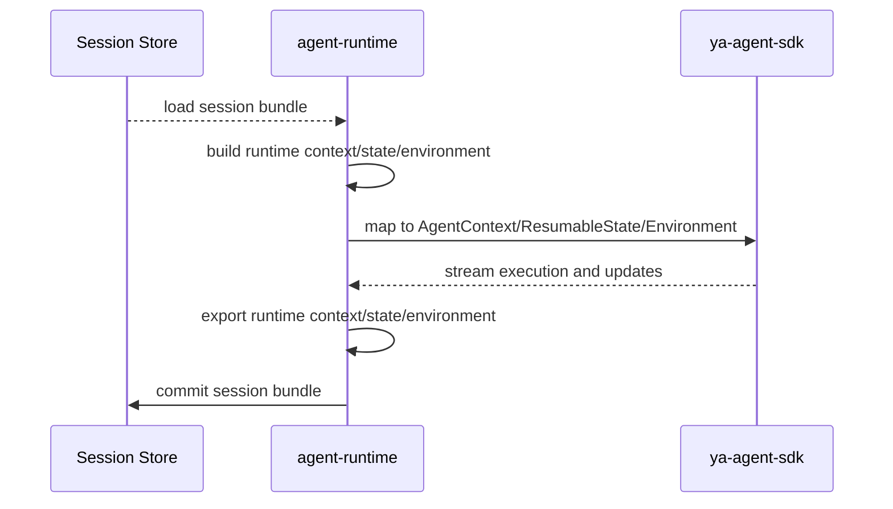

# Agent Runtime Agent SDK Integration

## Scope

This document defines the integration boundary between `agent-runtime` and `ya-agent-sdk`.

Runtime uses explicit abstractions to isolate SDK dependency:

- runtime context
- runtime state
- runtime environment
- runtime SDK adapter

## Design Principles

- Keep SDK coupling behind adapter boundary
- Keep runtime state aligned with session bundle model
- Keep abstractions extensible without business coupling
- Keep lifecycle mapping explicit and predictable

## Integration Architecture

## Runtime Abstraction Responsibilities

| Abstraction         | Responsibility                                             |
| ------------------- | ---------------------------------------------------------- |
| Runtime Context     | Runtime-scoped execution context and control metadata      |
| Runtime State       | Serializable runtime state for persistence and resume      |
| Runtime Environment | Runtime environment contract for execution and tool access |
| Runtime SDK Adapter | Mapping between runtime abstractions and SDK primitives    |

## Session Bundle Alignment

## Lifecycle Mapping

## Extensibility Goals

- context schema evolution under runtime ownership
- state schema evolution under runtime ownership
- environment implementation swap with stable runtime contract
- SDK upgrade isolation through adapter layer

## Out of Scope

- concrete class signatures and implementation details
- provider-specific model tuning logic
- gateway-side business integration rules
