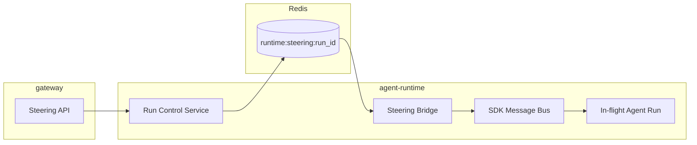
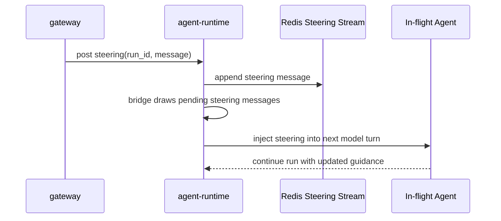

# Agent Runtime Steering

## Scope

This document defines real-time steering for in-flight runs in `agent-runtime`.

Steering allows gateway (or authorized clients through gateway) to inject control messages into a running agent without restarting the run.

## Design Principles

- Steering targets `run_id` as the control identity
- Steering is runtime control-plane data, not session persistence data
- Steering is best-effort near-real-time and bounded by run lifecycle
- Steering should be consistent for sync runs and async runs

## Steering Architecture

## Steering Lifecycle

## Steering Message Semantics

- Steering message is linked to one `run_id`
- Messages are consumed only while run is active
- Duplicate delivery is tolerated by run-side dedup strategy
- Steering stream expires after run termination plus grace window

## Boundary with Session and Events

- Steering messages are not part of session bundle
- Steering activity can emit runtime control events for observability
- Terminal run events remain the source of completion/failure truth

## Sync and Async Behavior

- Sync main-agent run: steering is consumed during long connection lifecycle
- Async run/subagent: steering is consumed while background run remains active

Both use the same `run_id` control path.

## Out of Scope

- Detailed steering payload schema
- Gateway authentication model for steering endpoint
- UX-level policy for who can steer and when
