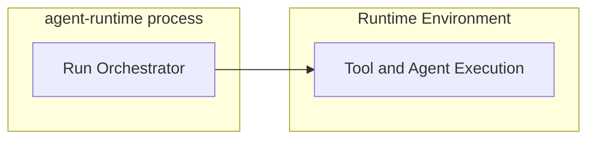

# Agent Runtime Security

## Scope

This document defines high-level security guidance for `agent-runtime`, including service security and runtime environment security.

## Design Principles

- Secure-by-default service entry
- Least-privilege runtime environment access
- Clear separation between control-plane security and execution-plane security
- Safety signals should be observable in logs and events

## Service Security

### Auth Header Baseline

- Runtime API requires auth header by default
- If auth token is not configured, runtime generates a bootstrap token at startup
- Generated bootstrap token is emitted to startup logs for operator retrieval

This keeps development bootstrap simple while preserving secure-by-default behavior.

### Control API Protection

Endpoints for run control (interrupt, steering, async control) must require the same auth baseline as execution endpoints.

### Network Exposure

Runtime should be deployed behind gateway/internal network boundary in production.

## Environment Security

### Environment Isolation

Execution environment should be isolated from control-plane internals and configured with minimal required permissions.

### Secret Handling

- Secrets are injected at runtime and should not be persisted in session bundles
- Logs and event streams must avoid exposing secret values

### Data Persistence Boundary

Session bundles persist only execution-recovery state. Security-sensitive operational data should remain outside session persistence.

## Operational Security Signals

- Auth failures should be visible in service logs
- Security-relevant control actions should emit runtime events
- Startup security mode (configured token or generated bootstrap token) should be explicit in logs

## Out of Scope

- Detailed cryptographic schemes
- Key management infrastructure design
- Compliance and audit framework details
